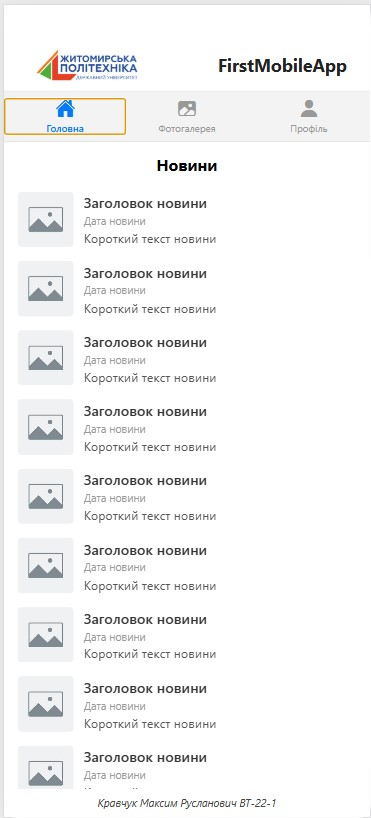
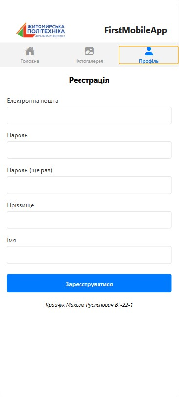

# lab1

## Опис проєкту
Проєкт є мобільним застосунком, створеним за допомогою React Native та Expo. Застосунок містить такі екрани: Головна, Фотогалерея, Профіль.

## Інструкція із запуску
1. Клонувати репозиторій:
`git clone https://github.com/kravcukMaks/MobileLabsRN2026.git`

2. Перейти в папку лабораторної роботи:
`cd lab1`

3. Встановити залежності:
`npm install`

4. Запустити проєкт:
`npx expo start`

## Основні способи запуску мобільного додатка

### 1. Expo Go
**Призначення:** запуск і тестування застосунку на реальному мобільному пристрої.  
**Особливості:** після запуску проєкту потрібно відсканувати QR-код у застосунку Expo Go.  
**Відмінності під час тестування:** дозволяє перевірити роботу застосунку безпосередньо на телефоні.

### 2. Android Emulator
**Призначення:** запуск і тестування застосунку на віртуальному Android-пристрої.  
**Особливості:** потребує встановленого Android Studio та налаштованого емулятора.  
**Відмінності під час тестування:** дає можливість перевіряти застосунок без фізичного смартфона.

### 3. Web
**Призначення:** швидкий перегляд інтерфейсу застосунку у браузері.  
**Особливості:** запускається як вебверсія через Expo.  
**Відмінності під час тестування:** зручно для швидкої перевірки, але поведінка може відрізнятися від мобільного застосунку.

## Скріншоти екранів застосунку

### Головна

### Фотогалерея

### Профіль
