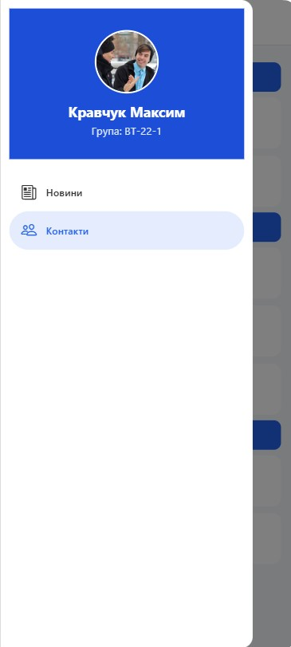
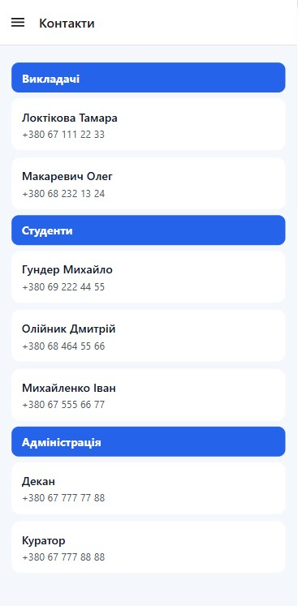

# lab2

## Опис проєкту
 Проєкт є мобільним застосунком, створеним за допомогою React Native та Expo. У застосунку реалізовано вкладену навігацію з використанням Drawer Navigator та Stack Navigator. Застосунок містить такі екрани: Новини, Деталі новини, Контакти.

## Інструкція із запуску
1. Клонувати репозиторій:
`git clone https://github.com/kravcukMaks/MobileLabsRN2026.git`

2. Перейти в папку лабораторної роботи:
`cd /lab2`

3. Встановити залежності:
`npm install`

4. Запустити проєкт:
`npx expo start -c`

## Опис реалізованого функціоналу
У застосунку реалізовано Drawer Navigator, який містить пункт меню Новини та пункт меню Контакти. Для екрана новин використано вкладений Stack Navigator з екранами MainScreen та DetailsScreen.

На екрані новин реалізовано список за допомогою FlatList. Кожна новина містить id, title, description та image. Для списку реалізовано Pull-to-Refresh з використанням refreshing, onRefresh та імітацією мережевого запиту через setTimeout. Також реалізовано Infinite Scroll за допомогою onEndReached та onEndReachedThreshold. Додано ListHeaderComponent, ListFooterComponent, ItemSeparatorComponent, а також параметри оптимізації initialNumToRender, maxToRenderPerBatch, windowSize.

На екрані DetailsScreen реалізовано перехід з MainScreen, передачу параметрів новини, динамічний заголовок екрана деталей та усунення подвійного header.

Екран контактів реалізовано через SectionList. Використано sections, renderItem, renderSectionHeader, keyExtractor та ItemSeparatorComponent.

Також створено власний drawerContent, який містить аватар, ПІБ, групу, пункт меню Новини та пункт меню Контакти.

## Скріншоти роботи застосунку

### Новини

### Drawer Menu

### Деталі новини

### Контакти

## Висновки

### 1. Чим відрізняється FlatList від ScrollView?
FlatList відрізняється від ScrollView тим, що ScrollView одразу рендерить усі елементи списку, тому більше підходить для невеликих наборів даних. FlatList рендерить лише видимі елементи та частину сусідніх, тому краще підходить для великих списків.

### 2. Що таке віртуалізація списків?
Віртуалізація списків — це механізм, при якому одночасно відображаються не всі елементи списку, а тільки ті, які зараз знаходяться в області видимості користувача. Це зменшує навантаження на пам’ять і підвищує продуктивність застосунку.

### 3. Як здійснюється передача параметрів між екранами?
Передача параметрів між екранами здійснюється за допомогою методу navigation.navigate, у який передаються назва екрана та об’єкт параметрів. На іншому екрані ці параметри отримуються через route.params.

### 4. Що таке вкладена навігація?
Вкладена навігація — це спосіб організації навігації, при якому один навігатор містить інший. У цій лабораторній роботі Drawer Navigator містить Stack Navigator для екранів новин.

### 5. У яких випадках застосовується SectionList?
SectionList застосовується у випадках, коли потрібно відобразити список, поділений на окремі секції або групи. Наприклад, контакти за категоріями, повідомлення за датами або товари за розділами.