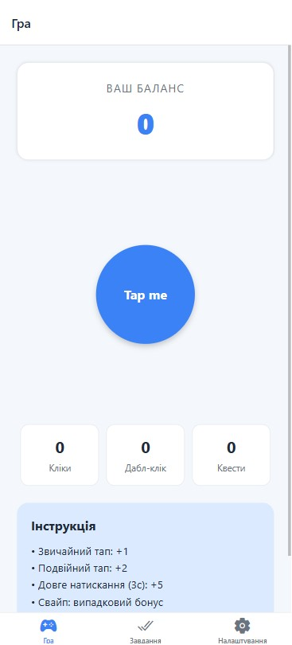
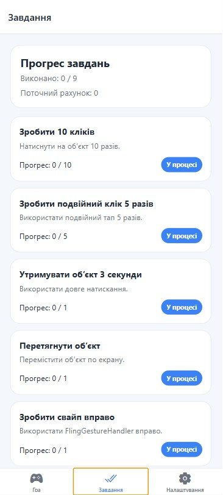
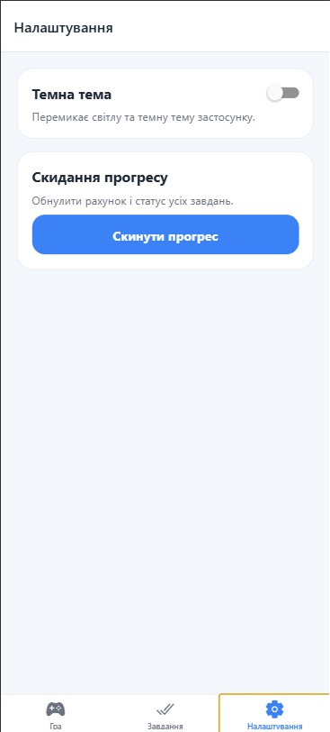

# lab3

## Опис проєкту
  Проєкт є мобільним застосунком у форматі гри-клікера за допомогою **React Native** та **Expo**.Основна ідея застосунку — взаємодія користувача з ігровим об’єктом за допомогою різних жестів для отримання очок і виконання завдань.

## Інструкція із запуску
1. Клонувати репозиторій:
`git clone https://github.com/kravcukMaks/MobileLabsRN2026.git`

2. Перейти в папку лабораторної роботи:
`cd /lab3`

3. Встановити залежності:
`npm install`

4. Запустити проєкт:
`npx expo start -c`

## Опис реалізованого функціоналу

Даний застосунок являє собою мобільну гру в жанрі "клікер". Основна механіка полягає у взаємодії з головним екраном через різноманітні сенсорні жести. Кожна успішна дія приносить користувачеві ігрові бали та синхронно оновлює статистику виконання квестів.

На **головному екрані** відображається поточний рахунок користувача, статистика натискань і центральний інтерактивний об’єкт. Саме з ним пов’язана основна логіка гри.

У застосунку підтримуються такі типи жестів:
- **одинарний тап** — збільшує рахунок на 1 очко;
- **подвійний тап** — збільшує рахунок на 2 очки;
- **довге натискання** — після утримання об’єкта протягом 3 секунд додає бонусні очки;
- **перетягування об’єкта** — дає можливість переміщувати ігровий елемент по екрану;
- **свайп вправо** — нараховує випадкову кількість очок;
- **свайп вліво** — нараховує випадкову кількість очок;
- **pinch-жест** — дозволяє змінювати розмір об’єкта та отримувати бонусні очки.

На **екрані завдань** реалізовано систему цілей, які користувач має виконати під час гри. Для кожного завдання відображається:
- назва;
- короткий опис;
- поточний прогрес;
- статус виконання.

Серед завдань передбачено:
- зробити 10 кліків;
- зробити 5 подвійних кліків;
- виконати довге натискання;
- перетягнути об’єкт;
- зробити свайп вправо;
- зробити свайп вліво;
- змінити розмір об’єкта;
- набрати 100 очок;
- виконати додаткове власне завдання.

На **екрані налаштувань** реалізовано:
- перемикання між світлою та темною темою;
- кнопку скидання прогресу гри, яка обнуляє рахунок і статус виконаних завдань.

Для навігації між екранами використано **React Navigation**, а для стилізації інтерфейсу — **Styled Components**. У застосунку реалізовано акуратний сучасний інтерфейс із підтримкою двох тем оформлення.

## Скріншоти

### Головний екран

### Екран завдань

### Екран налаштувань і темна тема
