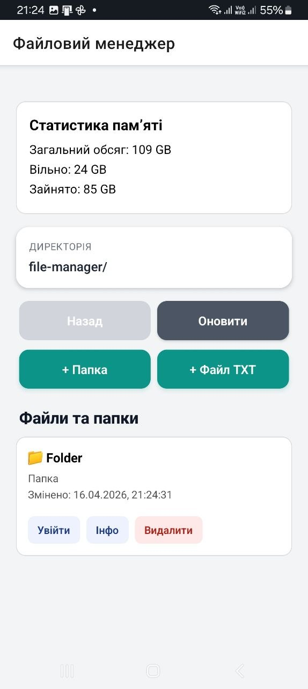
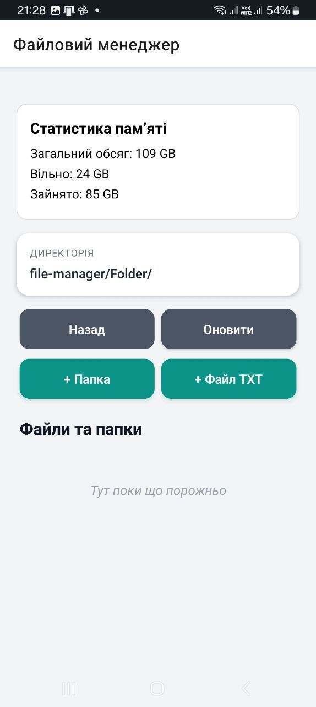
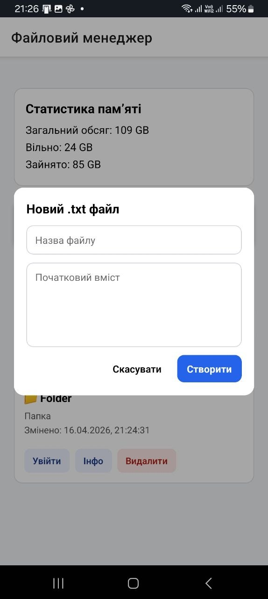
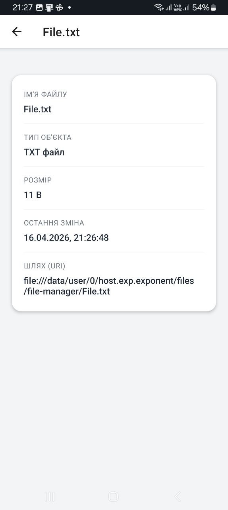
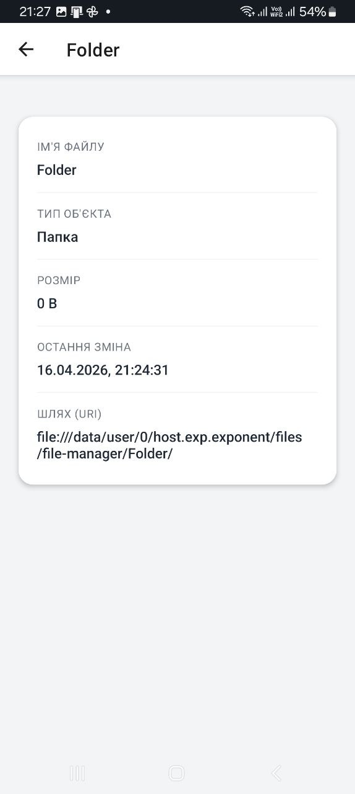

# lab4

## Опис проєкту
  Це мобільний файловий менеджер, розроблений стек-технологіями React Native та Expo. Застосунок реалізує повний цикл роботи (CRUD) з локальною файловою системою: навігацію ієрархією папок, створення, редагування та видалення директорій і .txt файлів, а також читання властивостей об'єктів. Окремою функцією є вбудований аналізатор використання дискового простору пристрою.

## Інструкція із запуску
1. Клонувати репозиторій:
`git clone https://github.com/kravcukMaks/MobileLabsRN2026.git`

2. Перейти в папку лабораторної роботи:
`cd /lab4`

3. Встановити залежності:
`npm install`

4. Запустити проєкт:
`npx expo start -c`

## Опис реалізованого функціоналу

Проєкт включає базовий файловий менеджер локальної системи. Інтерфейс виводить поточний шлях, вміст відкритої директорії та інформацію про стан пам'яті пристрою (всього/зайнято/вільно). Базові функції включають ієрархічну навігацію (перехід у папки та повернення назад), а також синхронізацію (оновлення) списку файлів.

Застосунок дозволяє створювати папки та файли .txt із заданим початковим вмістом. Вбудований редактор забезпечує можливості перегляду, зміни та збереження текстової інформації. Операції видалення файлів і директорій захищені діалоговим вікном підтвердження для запобігання випадковій втраті даних.

Окремий модуль відповідає за читання та вивід метаданих (назва, тип, розмір у байтах, дата модифікації, URI-шлях) для будь-якого вибраного об'єкта. UI/UX Дизайн: Інтерфейс оптимізовано для мобільних пристроїв. Впроваджено систему візуальних маркерів для розрізнення типів файлів, безшовну навігацію екранами (React Navigation) та мінімалістичну панель керування файловими операціями.

## Скріншоти роботи застосунку

### Головний екран

### Навігація по папках

### Створення папки або текстового файлу

### Редагування текстового файлу

### Детальна інформація про файл або папку

