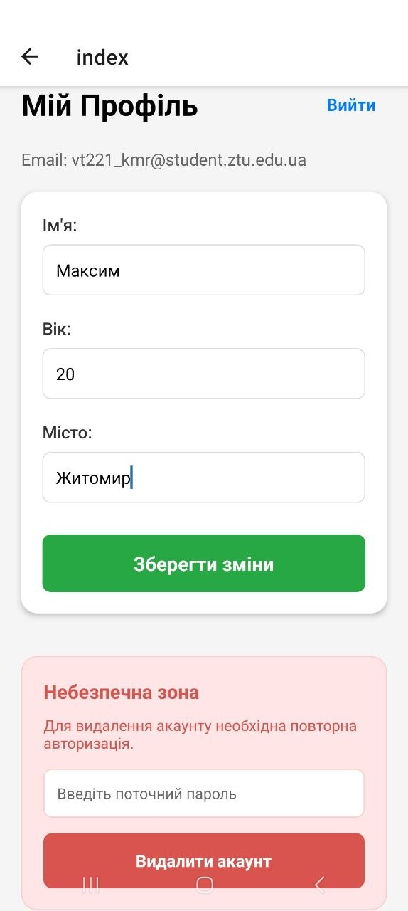
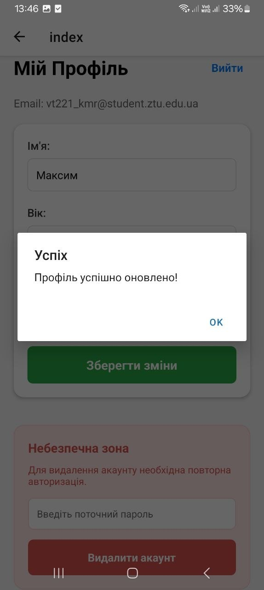
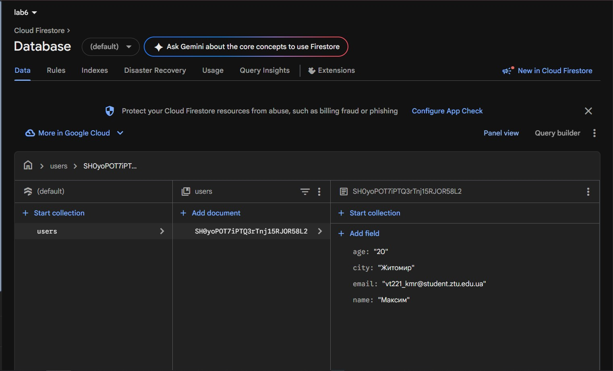
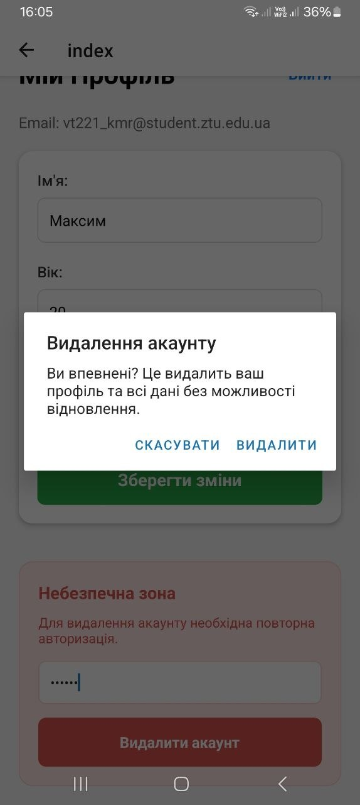

# Лабораторна робота №6: Побудова авторизації та збереження персональних даних у React Native з використанням Firebase

**Виконав:** студент групи ВТ-22-1 Кравчук Максим  
**Предмет:** Розробка мобільних додатків

---

## 🚀 Інструкція запуску

1. **Клонування репозиторію:**
   ```bash
   git clone https://github.com/kravcukMaks/MobileLabsRN2026.git
   cd lab6
   ```
2. **Встановлення залежностей:**
   ```bash
   npm install
   npx expo install firebase @react-native-async-storage/async-storage
   ```
3. **Налаштування Firebase:**
   - Створіть проєкт у [Firebase Console](https://console.firebase.google.com/).
   - Увімкніть **Authentication** (Email/Password) та **Firestore Database**.
   - Оновіть файл `firebaseConfig.js` своїми ключами доступу.
   - Встановіть правила безпеки (Rules) у Firestore для захисту даних користувачів.
4. **Запуск сервера розробки:**
   ```bash
   npx expo start
   ```
5. **Запуск на пристрої:**
   - Відскануйте QR-код через додаток **Expo Go** на вашому смартфоні.

---

## 🛠 Опис реалізованого функціоналу

У ході лабораторної роботи було розроблено додаток, інтегрований із сервісами Firebase:

- **Авторизація (Firebase Authentication):**
  - Реєстрація нових користувачів.
  - Вхід у систему та збереження сесії через `AsyncStorage` (користувач залишається авторизованим після перезапуску).
  - Відновлення пароля через email за допомогою Firebase API.
- **Збереження персональних даних (Firestore):**
  - Після входу користувач має доступ до профілю, де може вказати/оновити **Ім’я, Вік та Місто**.
  - Дані зберігаються у колекції `users` під унікальним `uid` користувача.
- **Захист доступу:**
  - Реалізовано перевірку `uid` у клієнтському коді та через **Firestore Security Rules**, що забороняє користувачам доступ до чужих документів.
  - Захищена навігація через групи маршрутів `(auth)` та `(app)` за допомогою `Expo Router`.
- **Керування обліковим записом:**
  - Можливість редагування профілю.
  - Функція видалення акаунту, яка вимагає **повторної автентифікації** (введення поточного пароля) для підтвердження особи перед видаленням даних.

---

## 🔒 Правила безпеки Firestore (Security Rules)

Для виконання п.3 завдання було налаштовано такі правила:

```javascript
match /users/{userId} {
  allow read, write: if request.auth != null && request.auth.uid == userId;
}
```

---

## 📸 Скріншоти роботи застосунку

| Реєстрація | Вхід у систему | Профіль (Firestore) | Видалення акаунту | | Firebase | | Оновлення |







---

## 📚 Висновки

Під час виконання лабораторної роботи №6 я набув практичних навичок роботи з платформою **Firebase** у середовищі React Native.

**Основні результати:**

1.  **Інтеграція Auth:** Навчився реалізовувати повний цикл авторизації, включаючи реєстрацію, скидання пароля та безпечне видалення користувача.
2.  **Робота з NoSQL:** Опанував базові операції з Firestore (get, set, merge, delete) та зрозумів принципи збереження даних у хмарі.
3.  **Безпека:** Реалізував захист даних на рівні сервера за допомогою правил Firestore, що є критично важливим для мобільних застосунків.
4.  **UX/UI:** Використав `AsyncStorage` для покращення досвіду користувача (persistence), щоб стан авторизації не втрачався при закритті додатку.

Додаток успішно виконує всі поставлені завдання, забезпечуючи стабільний зв'язок між клієнтською частиною на Expo та хмарним бекендом Firebase.
